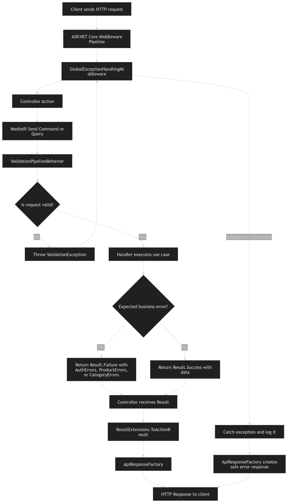
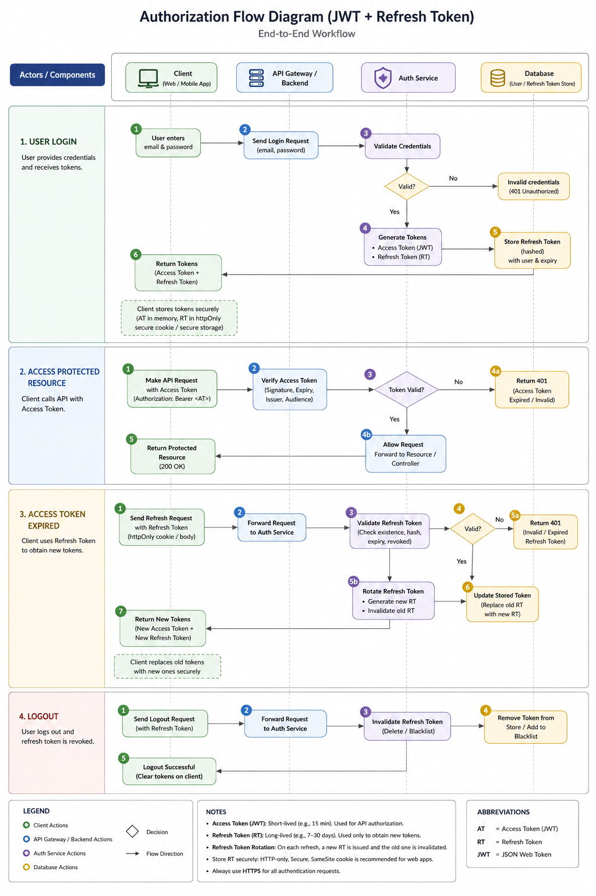
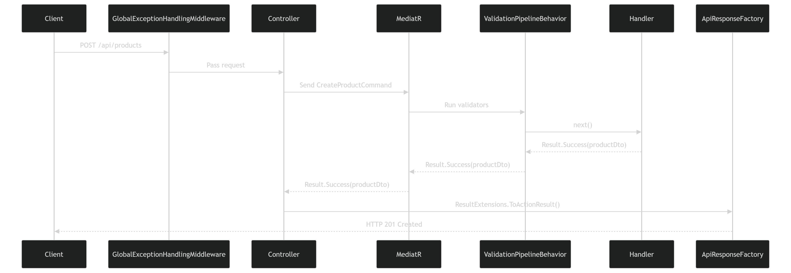
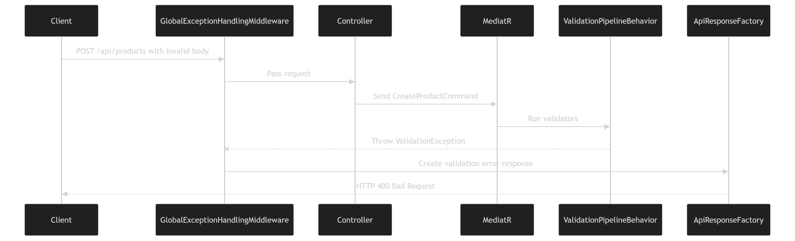
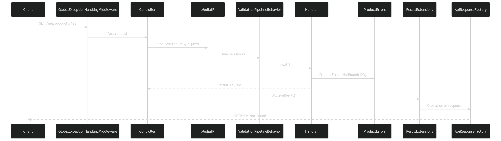
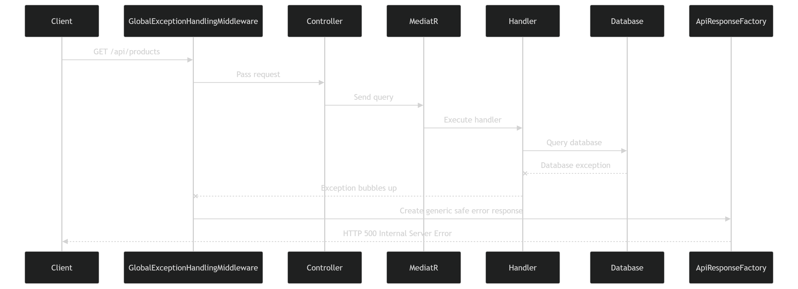

# 🛒 Ecommerce API

A modern, scalable e-commerce REST API built with **ASP.NET Core** using **Clean Architecture** principles. This project demonstrates best practices in API design, including CQRS pattern with MediatR, comprehensive validation, and structured error handling.

---

## 📋 Table of Contents

- [Project Overview](#project-overview)
- [Features](#features)
- [Technology Stack](#technology-stack)
- [Architecture](#architecture)
- [Project Structure](#project-structure)
- [Getting Started](#getting-started)
- [API Workflows](#api-workflows)
- [Development](#development)

---

## 📖 Project Overview

The **Ecommerce API** is a comprehensive backend solution for managing an e-commerce platform. It provides robust APIs for managing:

- **Products** - Create, read, update, and manage product inventory
- **Categories** - Organize products into categories
- **Orders** - Process and track customer orders
- **Order Items** - Manage individual items within orders

The API is designed with enterprise-grade architecture patterns, including separation of concerns, validation at multiple layers, and comprehensive error handling with meaningful responses to clients.

### Key Objectives

✅ Implement a production-ready REST API  
✅ Follow Clean Architecture principles  
✅ Provide comprehensive validation and error handling  
✅ Support CQRS pattern for scalability  
✅ Maintain code quality and testability  

---

## ✨ Features

- **RESTful API** - Standard HTTP methods and status codes
- **Clean Architecture** - Separated concerns with Domain, Application, Infrastructure, and API layers
- **CQRS Pattern** - Commands and Queries separation using MediatR
- **Validation** - FluentValidation for comprehensive input validation
- **Error Handling** - Structured error responses with meaningful messages
- **OpenAPI/Swagger** - Built-in API documentation
- **Entity Management** - Products, Categories, Orders, and OrderItems
- **Business Logic** - Domain-driven design with rich business rules
- **Unit & Integration Tests** - Comprehensive test coverage
- **Entity Relationships** - Strong relationships between Products, Categories, Orders, and OrderItems

---

## 🛠️ Technology Stack

| Layer | Technology |
|-------|-----------|
| **Runtime** | .NET 8+ |
| **Framework** | ASP.NET Core 8+ |
| **Language** | C# |
| **CQRS/Mediator** | MediatR |
| **Validation** | FluentValidation |
| **API Documentation** | OpenAPI (Swagger) |
| **Architecture Pattern** | Clean Architecture |
| **Testing** | xUnit (Unit & Integration Tests) |

---

## 🏗️ Architecture

This project follows **Clean Architecture** principles, ensuring a separation of concerns and high testability.

### Layers

```
┌─────────────────────────────────────────────┐
│         API Layer (Presentation)            │
│   Controllers, DTOs, HTTP Handlers          │
└─────────────────────────────────────────────┘
                      ↓
┌─────────────────────────────────────────────┐
│      Application Layer (Business Logic)     │
│   CQRS, MediatR, Use Cases, Validators      │
└─────────────────────────────────────────────┘
                      ↓
┌─────────────────────────────────────────────┐
│      Domain Layer (Core Business)           │
│   Entities, Value Objects, Enums, Rules     │
└─────────────────────────────────────────────┘
                      ↓
┌─────────────────────────────────────────────┐
│   Infrastructure Layer (External Services)  │
│   Database, Cache, Third-party APIs         │
└─────────────────────────────────────────────┘
```

---

## 📁 Project Structure

```
EcommerceApi/
├── src/
│   ├── Ecommerce.Api/                    # API Layer - Controllers & HTTP handling
│   │   ├── Controllers/
│   │   ├── Program.cs
│   │   ├── appsettings.json
│   │   └── appsettings.Development.json
│   │
│   ├── Ecommerce.Application/            # Application Layer - Business logic & CQRS
│   │   ├── DependencyInjection.cs
│   │   ├── Common/
│   │   │   ├── Interfaces/
│   │   │   └── Models/
│   │   └── [Features organized by domain]
│   │
│   ├── Ecommerce.Domain/                 # Domain Layer - Core business rules
│   │   ├── Entities/
│   │   │   ├── Product.cs                # Product aggregate
│   │   │   ├── Category.cs               # Category aggregate
│   │   │   ├── Order.cs                  # Order aggregate
│   │   │   └── OrderItem.cs              # OrderItem entity
│   │   ├── Enums/
│   │   │   └── OrderStatus.cs            # Order status enumeration
│   │   ├── Common/
│   │   │   └── BaseEntity.cs             # Base entity class
│   │   └── [Additional domain objects]
│   │
│   └── Ecommerce.Infrastructure/         # Infrastructure Layer - Data access & services
│       ├── Class1.cs
│       └── [Database context, repositories]
│
├── tests/
│   ├── Ecommerce.UnitTests/              # Unit tests
│   │   └── UnitTest1.cs
│   │
│   └── Ecommerce.IntegrationTests/       # Integration tests
│       └── UnitTest1.cs
│
├── Diagrams/                             # Flow diagrams
│   ├── MainFlowDiagram.png
│   ├── AuthorizationFlowDiagram.png
│   ├── SuccessfulResponseDiagram.png
│   ├── ValidationErrorDiagram.png
│   ├── ExpectedBussinesErrorDiagram.png
│   └── UnexpectedExceptionDiagram.png
│
├── EcommerceApi.slnx                     # Solution file
├── README.md                             # This file
├── AGENTS.md                             # AI agents documentation
└── LICENSE

```

---

## 🚀 Getting Started

### Prerequisites

- .NET 8 or higher installed
- Visual Studio Code, Visual Studio 2022, or similar
- Git

### Installation

1. **Clone the repository**
   ```bash
   git clone https://github.com/yourusername/EcommerceApi.git
   cd EcommerceApi
   ```

2. **Restore dependencies**
   ```bash
   dotnet restore
   ```

3. **Build the solution**
   ```bash
   dotnet build
   ```

4. **Run the API**
   ```bash
   cd src/Ecommerce.Api
   dotnet run
   ```

   The API will be available at: `https://localhost:5001`

5. **Access Swagger/OpenAPI Documentation**
   
   Navigate to: `https://localhost:5001/openapi/v1.json`

### Running Tests

```bash
# Run all tests
dotnet test

# Run unit tests only
dotnet test tests/Ecommerce.UnitTests

# Run integration tests only
dotnet test tests/Ecommerce.IntegrationTests

# Run with coverage
dotnet test /p:CollectCoverage=true
```

---

## 📊 API Workflows

The following diagrams illustrate the various workflows and error handling scenarios in the API:

### 1. Main Flow Diagram
This diagram shows the primary request-response flow for successful operations.



### 2. Authorization Flow Diagram
This diagram illustrates the authorization and authentication workflow.



### 3. Successful Response Diagram
This diagram details the structure of successful API responses.



### 4. Validation Error Diagram
This diagram shows how validation errors are handled and returned to clients.



### 5. Expected Business Error Diagram
This diagram illustrates handling of expected business logic errors.



### 6. Unexpected Exception Diagram
This diagram demonstrates the handling of unexpected exceptions.



---

## 🏗️ Core Entities

### Product
Represents a product in the e-commerce system.

**Key Properties:**
- `Id` - Unique identifier
- `Name` - Product name (required, validated)
- `Description` - Product description
- `Price` - Product price (must be > 0)
- `Stock` - Available quantity (must be ≥ 0)
- `CategoryId` - Reference to product category
- `CreatedAt` - Creation timestamp

### Category
Represents product categories for organization.

**Key Properties:**
- `Id` - Unique identifier
- `Name` - Category name
- `Description` - Category description
- `Products` - Collection of products in this category

### Order
Represents customer orders.

**Key Properties:**
- `Id` - Unique identifier
- `CustomerId` - Reference to customer
- `Status` - Order status (Pending, Confirmed, Shipped, Delivered, Cancelled)
- `Items` - Collection of order items
- `CreatedAt` - Order creation timestamp

### OrderItem
Represents individual items within an order.

**Key Properties:**
- `Id` - Unique identifier
- `OrderId` - Reference to parent order
- `ProductId` - Reference to ordered product
- `Quantity` - Quantity ordered
- `UnitPrice` - Price at time of order
- `TotalPrice` - Calculated total (Quantity × UnitPrice)

---

## 🛣️ API Endpoints

### Products
- `GET /api/products` - Get all products
- `GET /api/products/{id}` - Get product by ID
- `POST /api/products` - Create new product
- `PUT /api/products/{id}` - Update product
- `DELETE /api/products/{id}` - Delete product

### Categories
- `GET /api/categories` - Get all categories
- `GET /api/categories/{id}` - Get category by ID
- `POST /api/categories` - Create new category
- `PUT /api/categories/{id}` - Update category
- `DELETE /api/categories/{id}` - Delete category

### Orders
- `GET /api/orders` - Get all orders
- `GET /api/orders/{id}` - Get order by ID
- `POST /api/orders` - Create new order
- `PUT /api/orders/{id}` - Update order status
- `DELETE /api/orders/{id}` - Cancel order

### OrderItems
- `GET /api/orders/{orderId}/items` - Get items in order
- `POST /api/orders/{orderId}/items` - Add item to order
- `DELETE /api/orders/{orderId}/items/{itemId}` - Remove item from order

---

## 👨‍💻 Development

### Code Organization

- **Controllers** - Handle HTTP requests and delegate to application layer
- **DTOs (Data Transfer Objects)** - Define request/response contracts
- **Commands** - CQRS commands for state-changing operations
- **Queries** - CQRS queries for reading data
- **Handlers** - MediatR handlers for processing commands and queries
- **Validators** - FluentValidation validators for input validation
- **Services** - Business logic and domain services
- **Repositories** - Data access abstraction

### Adding New Features

1. Create domain entity in `Ecommerce.Domain/Entities/`
2. Create validators in `Ecommerce.Application/`
3. Create CQRS handlers (Command/Query) in `Ecommerce.Application/`
4. Create DTOs in `Ecommerce.Api/`
5. Create controller endpoint in `Ecommerce.Api/Controllers/`
6. Write unit and integration tests

### Code Standards

- Use nullable reference types (`#nullable enable`)
- Follow C# naming conventions (PascalCase for classes, camelCase for local variables)
- Add XML documentation comments for public members
- Keep methods focused and single-responsibility
- Write comprehensive unit tests for business logic
- Use FluentValidation for all input validation

---

## 📝 Configuration

### appsettings.json
```json
{
  "Logging": {
    "LogLevel": {
      "Default": "Information"
    }
  },
  "AllowedHosts": "*"
}
```

### appsettings.Development.json
For development-specific configuration and secrets.

---

## 📦 Dependencies

- **MediatR** - CQRS pattern implementation
- **FluentValidation** - Input validation
- **Microsoft.AspNetCore.OpenApi** - OpenAPI support
- **xUnit** - Testing framework
- **Moq** - Mocking library

---

## 🤝 Contributing

1. Create a feature branch (`git checkout -b feature/amazing-feature`)
2. Commit your changes (`git commit -m 'Add amazing feature'`)
3. Push to the branch (`git push origin feature/amazing-feature`)
4. Open a Pull Request

---

## 📄 License

This project is licensed under the MIT License - see the LICENSE file for details.

---

## 📞 Support

For support, issues, or questions, please open an issue on the GitHub repository.

---

## 🎯 Roadmap

- [ ] Add database layer (EF Core)
- [ ] Implement authentication/authorization (JWT)
- [ ] Add caching layer (Redis)
- [ ] Implement logging and monitoring
- [ ] Add API rate limiting
- [ ] Create CI/CD pipeline
- [ ] Add comprehensive API documentation

---

**Last Updated:** July 22, 2026

Made with ❤️ by the Development Team
